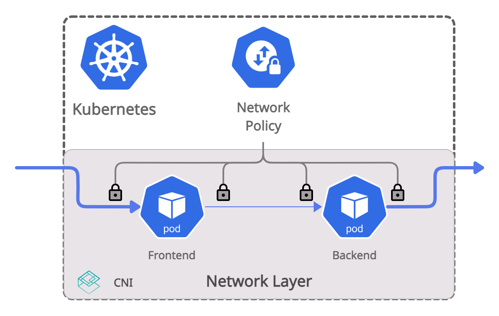

# Network Policy

## Introduction

NetworkPolicy is a standardized Kubernetes object to control the allowed network traffic patterns between Kubernetes pods and namespaces as well as any traffic entering or leaving the cluster.
NetworkPolicies are implemented and enforced by the [CNI plugin]. If you are using NetworkPolicies, make sure the CNI plugin you are using supports NetworkPolicy.
If no NetworkPolicies are loaded, all network communication in a cluster is allowed.
This repository lists resources such as tutorials, examples, and documentation to get you started with NetworkPolicy to secure your clusters.

## Getting Started

 * [Tutorial](https://github.com/networkpolicy/tutorial)
 * [NetworkPolicy Editor](https://editor.cilium.io/)

## Threat Models

 * To be done

## Documentation

### Kubernetes Documentation

 * [Concepts: Network Policies](https://kubernetes.io/docs/concepts/services-networking/network-policies/)
 * [Declare Networkpolicy](https://kubernetes.io/docs/tasks/administer-cluster/declare-network-policy/)

## Examples

 * [NetworkPolicy Examples Repository](https://github.com/networkpolicy/examples)

## About NetworkPolicy

This repository is a community effort to host and refer to NetworkPolicy
resources. Anybody can contribute. The effort was initially sparked by the
[Cilium team](https://github.com/cilium/cilium) to make the generic
NetworkPolicy parts in the Cilium documentation available to everyone. Even for
users which are not using Cilium.

[CNI plugin]: https://kubernetes.io/docs/concepts/extend-kubernetes/compute-storage-net/network-plugins/
